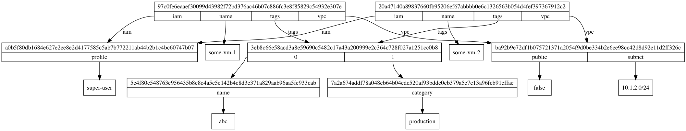

# What is it?

Single file library for creating content addressable graphs.

# Why?

I've been noodling about how to best represent cloud infrastructure as a graph and a content addressable graph
seems like the right way to do it.

# How do I use it?

It's a single file library so download/copy/etc. `graph.rb` to where you need to use it.

# Any examples?

Yes

```bash
ruby example.rb > g.dot
dot -Tpng g.dot > g.png
```



# Anything else?

Stay tuned.
